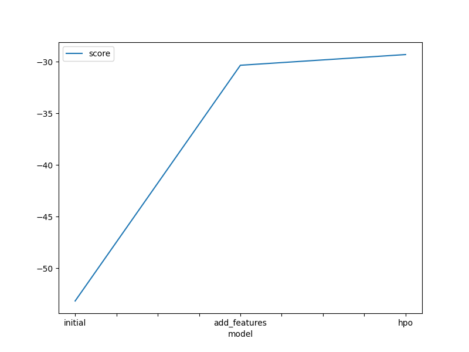
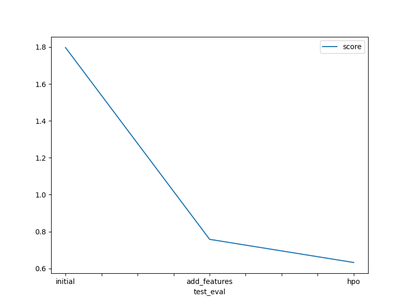

# Report: Predict Bike Sharing Demand with AutoGluon Solution
#### Saydobid Khusanov

## Initial Training
### What did you realize when you tried to submit your predictions? What changes were needed to the output of the predictor to submit your results?
The model was initially trained with the default parameters of the train dataset. The parameters 
had to match those of the test set's. The resulting predictor was used to predict the test set values.
The parameters of the train and test sets had to match.

### What was the top ranked model that performed?
The top ranked model was the one with hyperparameter tuning. It was at the optimization step to enhance the 
model's performance after having added additional features.

## Exploratory data analysis and feature creation
### What did the exploratory analysis find and how did you add additional features?
The exploratory analysis showed the distributions of the features. It was visible that the datetime feature
did not have a meaningful distribution (almost uniform) due to its dependency on other time-specific attributes.
Therefore, it had to be split into three independent features.

### How much better did your model preform after adding additional features and why do you think that is?
The model performed almost twice better on the validation set. The same pattern of improvement was achieved on Kaggle 
as well.

## Hyper parameter tuning
### How much better did your model preform after trying different hyper parameters?
The model performed better after extending the training time and setting auto stack to True.

### If you were given more time with this dataset, where do you think you would spend more time?
I would spend more time on feature engineering. I would try to extend the number of features by considering more
data types and corresponding values.

### Create a table with the models you ran, the hyperparameters modified, and the kaggle score.

| model        | hpo1       | hpo2    | hpo3       | score   |
|--------------|------------|---------|------------|---------|
| initial      | time_limit | presets | -          | 1.79717 |
| add_features | time_limit | presets | -          | 0.75790 |
| hpo          | time_limit | presets | auto_stack | 0.63236 |

### Create a line plot showing the top model score for the three (or more) training runs during the project.

### Create a line plot showing the top kaggle score for the three (or more) prediction submissions during the project.

## Summary
This project mainly focused on predicting the bike sharing demand using the dataset provided by Kaggle.
It contained information about daily trends in 2011. The training process consisted of three parts, and 
the model's performance significantly improved thanks to the additional features. Hyperparameter tuning
also helped to find the better model.
